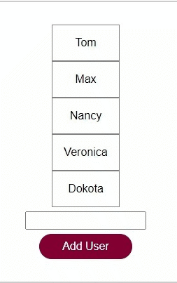

## Table of Contents

  - [Router](#router)
  - [Animation](#animation)

## Router

### Installing

Using npm:
```bash
$ npm install vue-router
```
In your main.js
```js
import { createRouter, createWebHistory } from 'vue-router';

const router = createRouter({
    history: createWebHistory(),
    routes: [
        {
            path: '/teams',
            component: TeamsList
        },
        {
            path: '/teams/:teamId',
            component: TeamMember
        }
    ]
});
const app = createApp(App);

app.use(router);
```
In the base component
```js
<router-view></router-view>
```
Navigation to the route
```js
<router-link to="/teams">
    Teams
</router-link>
```
Navigating programmatically
```js
this.$router.push('/teams');
```
Getting route params
```js
this.$route.params.teamId
```
Passing route param as prop
```js
{
    path: '/teams/:teamId',
    component: TeamMembers,
    props: true
},
```
And in the TeamMembers component, declare the prop
```js
props: ['teamId']
```
Handling undefined paths
```js
{
    path: '/:notFound(.*)',
    component: NotFound
}
```
Adding named routes
```js
{
    name: 'team-members',
    path: ':teamId',
    component: TeamMembers,
    props: true,
},
```
And in the component
```js
teamMembersLink() {
    return { name: 'team-members', params: { teamId: this.id } };
},
```
Passing query params
```js
teamMembersLink() {
    return {
        name: 'team-members',
        query: { sort: 'asc' },
    };
},
```
And for fetching query params
```js
this.$route.query.sort
```
Multiple router view
```js
{
    path: '/teams',
    components: {
        default: TeamsList, footer: TeamsFooter
    }
}
```
in the template for
```html
<main>
    <router-view></router-view>
</main>
<footer>
    <router-view name="footer"></router-view>
</footer>
```
Global Navigation guard
```js
router.beforeEach(function(to, from, next) {
    if (to.name === 'team-members) {
        next(); // allow navigation
    } else if (to.name === 'users') {
        next(false); // prevent navigation
    } else {
        next({ name: 'teams', params {...}}); // redirect
    }
});
```
Local Navigation guard
```js
{
    path: '/users',
    components: {default: UsersList, footer: UsersFooter},
    beforeEnter(to, from, next) {
        //...
        next();
    }
},
```
OR can be used in component 
```js
beforeRouteEnter(to, from, next) {
    //...
    next();
}
```
Router update handler
```js
beforeRouteUpdate(to, from, next) {
    //...
    next();
}
```
Global afterEach guard
```js
router.afterEach(function(to, from) {
    // ...
});
```
beforeRouteLeave hook
```js
beforeRouteLeave(function(to, from, next) {
    // ...
    next();
});
```
Adding Meta Data to a route
```js
{
    path: '/users',
    meta: { needAuth: true }, // can be accessed using this.$router.meta
    components: {default: UsersList, footer: UsersFooter}
},
```

## Animation

### Usage

* Vue provides animation classes for showing and hiding animations on elements.

Wrap the element in ```<transition></transition>``` tag
```html
<transition>
    <p v-if="showParagraph">This is a Paragraph...</p>
</transition>
```

This will provide following class for showing element
* .v-enter-from
* .v-enter-active
* .v-enter-to

and following classes for hiding element
* .v-leave-from
* .v-leave-active
* .v-leave-to

Define the css as shown below

```css
/* For showing element */
.v-enter-from {
  opacity: 0;
  transform: translateY(-30px);
}

.v-enter-active {
  transition: all 0.3s ease-in;
}

.v-enter-to {
  opacity: 1;
  transform: translateY(0px);
}

/* For hiding elements */
.v-leave-from {
  opacity: 1;
  transform: translateY(0px);
}

.v-leave-active {
  transition: all 0.3s ease-out;
}

.v-leave-to {
  opacity: 0;
  transform: translateY(30px);
}
```
Here is the end result


In case of multiple transitions, we can also provide a name to transition.
```html
<transition name="para">
</transition>
```
and then the classes will be
```css
.para-enter-from, .para-enter-active and so on
```
We can also provide custom classes to transition
```html
<transition
    enter-to-class="some-class"
    enter-active-class="...">
</transition>
```
In case of multiple transition elements, if we have elements in a case where only one of the element will be shown at a time in the DOM, then we don't need to give a name to the transition
```html
<transition mode="out-in">
    <button v-if="showButton">Show<button>
    <button v-else>Hide<button>
</transition>
```
`mode="out-in"` will ensure that the second element will only display once the first element is done it's transition

#### Transition Events

There are variout transition events that can be used to perform some tasks during the transition
```html
<transition
    @before-enter="beforeEnter"
    @enter="enter"
    @after-enter="afterEnter"
    @before-leave="beforeLeave"
    @leave="leave"
    @after-leave="afterLeave"
    @enter-cancelled="enterCancelled"
    @leave-cancelled="leaveCancelled">
    <!-- ... -->
</transition>
```
And in the component
```js
methods: {
    beforeEnter(el) {
        // ... el is Html Element on which transition is being performed
    },
    enter(el, done) {
        // done parameter is to indicate if we want to manually tell that the event id complete
        done();
    }
}
```
disabling css transitions
```html
<transition :css="false">
</transition>
```
#### Animating list items
```html
<transition-group tag="ul" name="user-names">
    <li v-for="user of users" :key="user" @click="removeUser(user)">
        {{ user }}
    </li>
</transition-group>
```
* `<transition-group>` has an attribute `tag` which will be the parent element of the list. It can be a custom component as well
* Rest of the functionality is the same as the `<transition>`

That will us the result



* Problem: The list snaps when any item is removed or added.

To avoid the snapping while insearting, Vue provides the below class
```css
.user-names-move {
    transition: transform 1s ease;
}
```
This *-move class adds transform animation under the hood. we need to just provide the transition property.

While removing the element we can provide `position: absolute` to `*-leave-active` class as shown below.
```css
.user-names-leave-active {
    /* ... */
    position: absolute;
}
```
And that'll give us the smooth animation effect


#### Route Transitions
wrap your router as shown below
```html
<router-view v-slot="{ Component }">
    <transition name="route" mode="out-in">
        <component :is="Component" />
    </transition>
</router-view>
```
and in the styles
```css
.route-enter-from,
.route-leave-to {
  opacity: 0;
}
.route-enter-active,
.route-leave-active {
  transition: opacity 1s ease;
}
.route-enter-to,
.route-leave-from {
  opacity: 1;
}
```
This will add effects while switching routes

This will also add the animation on the first route. Since the first route is empty according to Vue and we switch to '/' route.

To avoid that we can mount the app once the first route is loaded.
```js
router.isReady().then(function() {
  app.mount('#app');
})
```